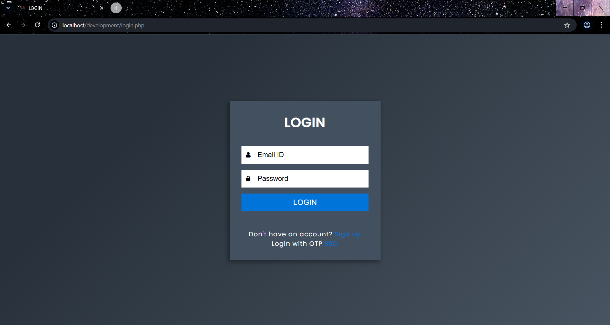

# Web-based Billing Software

This Web-based Billing Software (WBS) tool allows organizations to set up online bill management, consumers to read bills, and owners to save or download invoices for new businesses. In addition, an online billing webpage to handle invoices in the system and to assist clients in creating, updating, and calculating bills/invoices without having to manually list them.

This software system will rely only on the internet to provide a user-friendly environment for  owners. This solution is designed for Businessmen, Enterprises, Shopkeepers, Vendors, and Government Officers who don't want to spend time manually maintaining bills/invoices or computing whole bill computations.

### Features

- **User-friendly Interface**: Easy-to-use interface for business owners.
- **Online Bill Management**: Create, update, and calculate bills/invoices online.
- **Invoice Generation**: Save or download invoices for record-keeping.
- **Profile Management**: Update user profiles for personalized experience.
- **Report Generation**: Generate detailed reports for business analysis.
- **Product ShortHand**: Quickly check the quantity of the products left.
- **Giveaway Generator**: Randomly select giveaways for promotional activities.
- **Single Sign-On (SSO)**: Secure and convenient login experience.
- **Responsive Design**: Accessible on various devices, including desktops, tablets, and smartphones.

### Pages Overview

1. **Home Page**: The main page of the application, providing an overview and navigation to other features.
2. **Update Profile**: Allows users to update their personal information.
3. **Create Bill**: Interface for creating new bills and invoices.
4. **Manage Bill**: Manage existing bills and invoices, including editing and deleting.
5. **Generate Report**: Generate detailed reports for business analysis.
6. **Product ShortHand**: Quick access to frequently used products.
7. **Giveaway Generator**: Randomly select giveaways for promotional activities.
8. **Login/Signup**: Secure login and signup pages for user authentication.
9. **SSO**: Single Sign-On page for convenient access.

### Screenshots

Here are some screenshots of the key pages:

1. **Home Page**
   

2. **Update Profile Page**
   

3. **Create Bill Page**
   
   
5. **Manage Bill Page**
   

6. **Generate Report Page**
   

7. **Product ShortHand Page**
   

8. **Giveaway Generator Page**
   

9. **Login Page**
   

10. **Signup Page**
   

11. **SSO Page**
    

### Getting Started

Follow the instructions below to have a copy of this project up and running on your local machine for development and testing purposes.

#### Prerequisites

- **PHP**: A server scripting language for web development.
- **MySQL**: A relational database management system.
- **Composer**: Dependency manager for PHP.
- **XAMPP/WAMP**: Local server environment for PHP and MySQL.
- **Bootstrap**: A popular front-end framework for responsive web design.

## Installing the Project

1. Clone the repository to your local machine:
   ```bash
   git clone https://github.com/shashikira02/Billing-Software.git
2. Navigate to the project directory:
   ```bash
   cd Billing-Software
3. Install dependencies using Composer:
   ```bash
   composer install
### Running the Project

To run the Web-based Billing Software project, follow these steps:

1. Set Up the Database:
- Import the billsoftware.sql file into your MySQL database.
- Update the database configuration in connect.php with your database connection details.
2. Start the local Server:
- Using XAMPP/WAMP, start the Apache and MySQL services.
- Navigate to http://localhost/Billing-Software in your web browser.

### Built With
- **PHP**: Server-side scripting language.
- **MySQL**: Relational database management system.
- **HTML**: For structuring the web pages.
- **CSS**: For styling the web pages.
- **JavaScript**: For making the web pages dynamic.
- **Bootstrap**: For responsive design and UI components.
- **Composer**: For managing PHP dependencies.

## Project Debrief
**Web-based Billing Software** is a comprehensive solution for businesses looking to streamline their billing and invoicing processes. The application is developed with modern web development standards and offers a wide range of features commonly found in billing software.

### Features:
- **User-friendly Interface**: Easy-to-use interface for business owners.
- **Online Bill Management**: Create, update, and calculate bills/invoices online.
- **Invoice Generation**: Save or download invoices for record-keeping.
- **Profile Management**: Update user profiles for personalized experience.
- **Report Generation**: Generate detailed reports for business analysis.
- **Product ShortHand**: Quick access to frequently used products.
- **Giveaway Generator**: Randomly select giveaways for promotional activities.
- **Single Sign-On (SSO)**: Secure and convenient login experience.
- **Responsive Design**: Accessible on various devices, including desktops, tablets, and smartphones.

### License
This project is licensed under the MIT License - see the [LICENSE](./LICENSE) file for details.

